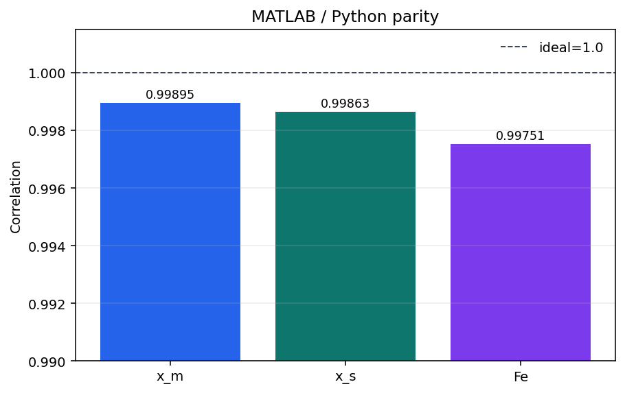

# MATLAB parity

`10_io_parity.ipynb` compares the MATLAB/Simulink reference and the Python
replica at the plant I/O boundary. It is the place to verify dynamics and
signal mappings before interpreting RL results.

The exact parity table and correlation bar graph are included at the end of
`10_io_parity.ipynb`.

## Recorded parity results

Against the MATLAB exported GUI signals, the current Python replica achieved
the following full-overlap correlations:

| Signal | Correlation |
|---|---:|
| `x_m` | 0.99895 |
| `x_s` | 0.99863 |
| `Fe` | 0.99751 |

## Correlation graph

Additional checks recorded by the project are a reproduced open-loop
singularity at approximately `33.793 s` and bounded behavior through `40 s`
under the reduced input `F_h(t) = 5 + 5 sin(0.5t)`.

The raw MATLAB export is not present in this checkout, so the notebook remains
the reproducibility entry point rather than a tracked static plot. This README
is limited to the MATLAB/Python parity result; the selected RL models are
reported in the policy-gradient READMEs.
