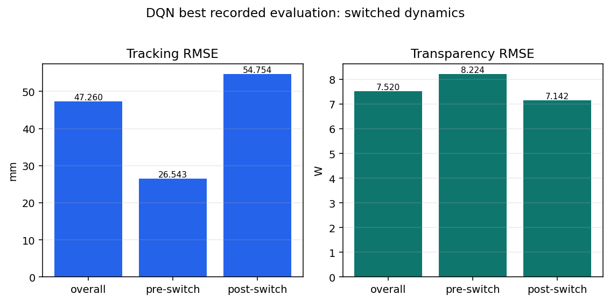

# Baselines

This section records trusted baseline runs:

- `20_dqn_legacy_baseline.ipynb` reviews the DQN baseline and reward choices;
  its final Results section contains the best recorded result and evaluation
  bars.
- `21_ql_workspace.ipynb` reviews the tabular Q-learning baseline; its final
  Results section records the current unavailable-artifact status.

The notebooks launch the reusable DQN and Q-learning scripts and display their
saved summaries, histories, and plots.

## DQN recorded result

Only the best recorded view from `20_dqn_legacy_baseline.ipynb` is retained:
the switched-dynamics evaluation for
`norm_legacy_trans_v1`. This is archival evidence from the embedded notebook
output because the original DQN result directory is not tracked in the current
checkout.

| Model | Mode | Tracking RMSE [mm] | Pre-switch [mm] | Post-switch [mm] | Transparency RMSE [W] | Pre-switch [W] | Post-switch [W] | Invalid episodes |
|---|---|---:|---:|---:|---:|---:|---:|---:|
| `DQN_baseline_norm_legacy_trans_v1_30s_10s` | switched dynamics | **47.260** | 26.543 | 54.754 | 7.520 | 8.224 | 7.142 | 0.0% |

The switched-dynamics result is the only DQN view promoted here. Its tracking
error increases after the skin-to-fat switch, while transparency error remains
lower after the switch. The zero invalid-episode rate indicates that the
recorded run completed the evaluation battery without invalid episodes, but the
missing raw result directory means the row is not a reproducible current
catalog entry.

## Q-learning result status

`21_ql_workspace.ipynb` has no saved Q-learning summary, evaluation table, or
reproducible Q-learning graph in the current checkout. There is no numeric
Q-learning result to promote as a best model.

| Item | Status |
|---|---|
| Q-learning result artifact | unavailable |
| Best-model row | not reported |
| Evaluation graph | not generated without numeric data |

The DQN and Q-learning raw result roots are not present in the current
checkout, so no reproducible baseline row is included in the current tracked
result catalog. The DQN row above is therefore archival evidence without the
original raw artifact. The existing launchers and notebook structure remain
ready for the Q-learning run to be restored.
