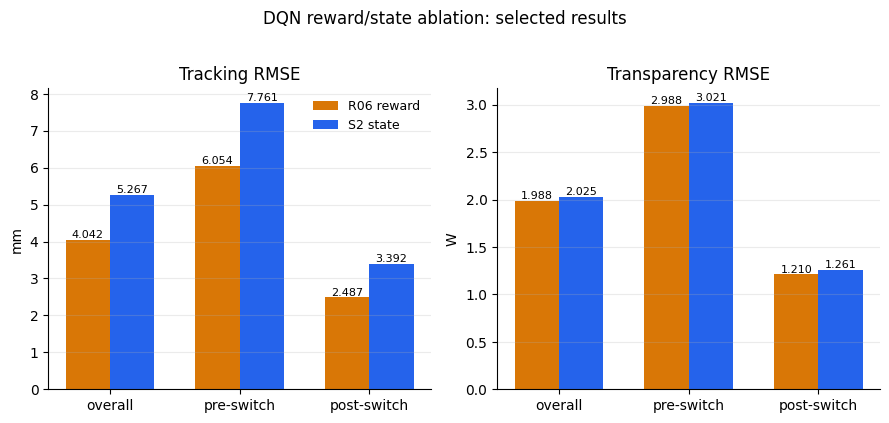

# Ablations

`30_reward_state_ablation.ipynb` compares reward and observation variants. The
table below promotes the best recorded DQN model from each ablation stage.

## Selected DQN ablation results

| Model | Stage | Tracking RMSE [mm] | Pre-switch [mm] | Post-switch [mm] | Transparency RMSE [W] | Pre-switch [W] | Post-switch [W] | Invalid episodes |
|---|---|---:|---:|---:|---:|---:|---:|---:|
| `r06_t70_tr10_j020` | reward | **4.042** | 6.054 | 2.487 | 1.988 | 2.988 | 1.210 | 0.0% |
| `S2_relative_mechanics` | state | 5.267 | 7.761 | 3.392 | 2.025 | 3.021 | 1.261 | 0.0% |

## Evaluation graph

## Analysis

The reward-stage winner `r06_t70_tr10_j020` has the lowest recorded tracking
and transparency RMSE of the two promoted rows. The state-stage winner
`S2_relative_mechanics` remains close, with a slightly higher overall tracking
error and transparency error. Both rows report zero invalid episodes. These are
selected rows from the executed notebook output; the full ablation tables
remain in the notebook, while the raw DQN result directory is not tracked.
