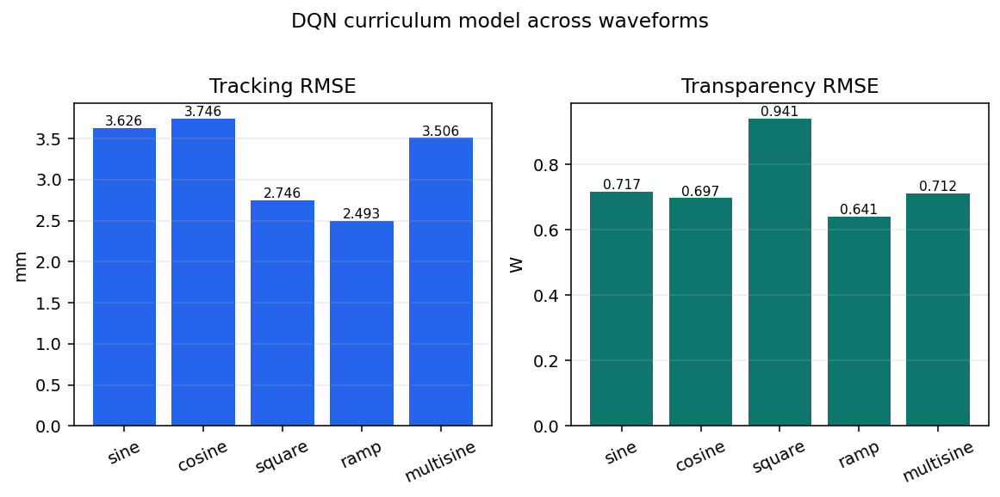

# Generalization

`40_waveform_generalization.ipynb` reviews policy behavior under alternate
force waveforms and input conditions using saved evaluation artifacts.

## Selected curriculum result

The warm-start curriculum DQN model is retained because it recorded zero
invalid episodes across all five tested waveforms and the strongest aggregate
errors in the executed notebook output. This is archival evidence from the
embedded notebook output because the original DQN result directory is not
tracked in the current checkout.

| Waveform | Tracking RMSE [mm] | Transparency RMSE [W] | Pre-switch track [mm] | Post-switch track [mm] | Pre-switch transp. [W] | Post-switch transp. [W] | Invalid episodes |
|---|---:|---:|---:|---:|---:|---:|---:|
| sine | 3.626 | 0.717 | 3.546 | 3.657 | 0.856 | 0.511 | 0.0% |
| cosine | 3.746 | 0.697 | 3.542 | 3.877 | 0.820 | 0.502 | 0.0% |
| square | 2.746 | 0.941 | 2.556 | 2.819 | 0.934 | 0.892 | 0.0% |
| ramp | **2.493** | **0.641** | 2.399 | 2.535 | 0.603 | 0.626 | 0.0% |
| multisine | 3.506 | 0.712 | 3.645 | 3.331 | 0.828 | 0.547 | 0.0% |

The ramp waveform gives the lowest tracking and transparency RMSE in the
selected table. The square waveform is also strong on tracking but has higher
transparency error. The curriculum policy remains valid on every tested
waveform, although the missing raw result directory prevents treating these
values as a newly reproducible run.

Waveform/generalization results are kept separate from the selected-model
fair-bias-15 comparison. Use [`../90_results/README.md`](../90_results/README.md)
for the tracked result catalog and figure gallery; new generalization runs
should be added there only after their protocol and signals are recorded.
