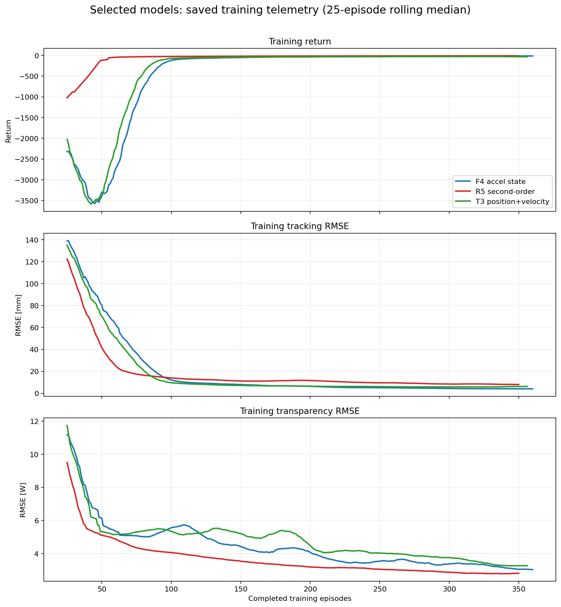
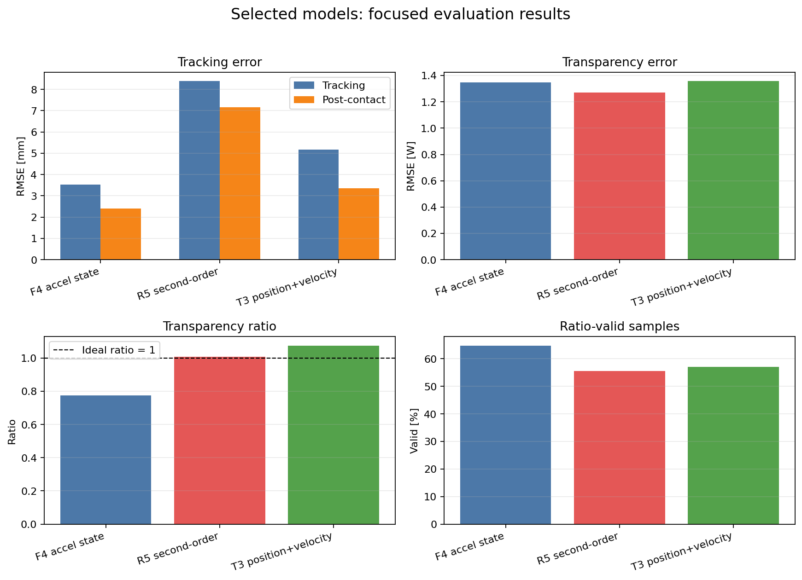
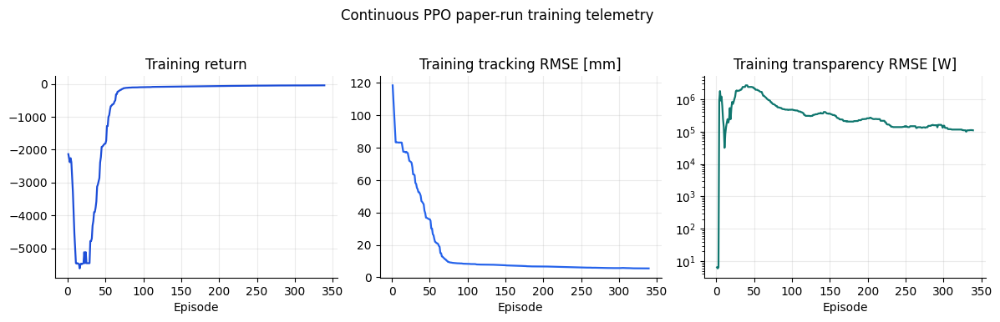
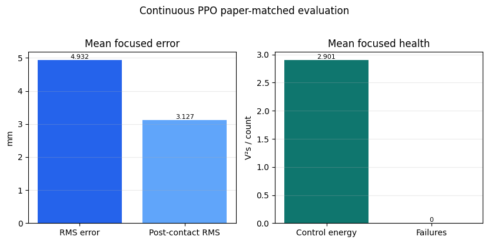
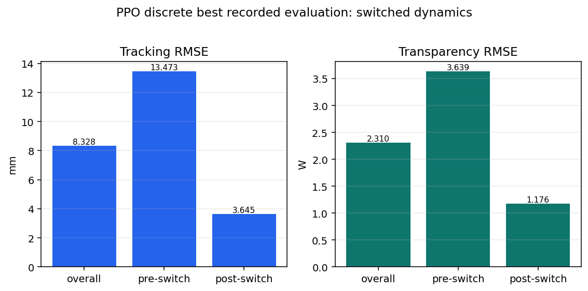

# Policy-gradient studies

This section contains the PPO, TD3, SAC, and recurrent policy-gradient
notebooks. The README records only the selected continuous-PPO models from the
current fair-bias-15 protocol.

Each source notebook ends with its own Results section. The section reports
the selected model when a result is available and records the unavailable
artifact status for runs that have no portable numeric summary.

## Selected models

`F4_accel_state` is the primary tracking candidate. `T3_posvel_current` is
retained as the temporal-observation alternative because it gives the best
tracking/transparency compromise among the temporal candidates.

| Model | Selection reason | Training endpoint track RMSE [mm] | Training endpoint transp. RMSE [W] | Focused eval track [mm] | Focused eval post-contact [mm] | Focused eval transp. [W] | Ratio | Ratio error RMSE | Valid |
|---|---|---:|---:|---:|---:|---:|---:|---:|---:|
| `F4_accel_state` | best training and focused tracking | 3.377 | 1.566 | **3.535** | 2.411 | 1.348 | 0.776 | 144.719 | 64.8% |
| `T3_posvel_current` | strongest temporal compromise | 5.440 | 2.335 | 5.177 | 3.348 | 1.357 | 1.075 | 417.006 | 57.0% |

## Training and evaluation graphs

The training graph uses the saved `train.npz` export of the callback scalars
(`teleop_train` and `teleop_eval`). The current checkout has no TensorBoard
event files in the `ppo/tb` folders. Evaluation is shown only with bar graphs.

The reward alternative `R5_second_order` is documented in
[`../30_ablations/README.md`](../30_ablations/README.md). All selected results
are single-study results and still require multi-seed validation.

## Per-notebook result records

### `51_ppo_continuous_baseline.ipynb`

The recorded result for the continuous-PPO notebook is the `ppoSingleSignal`
paper run: one 500,000-step model evaluated on the 25-scenario paper-matched
battery.

| Model | Single-signal eval tracking RMSE [mm] | Single-signal eval transparency RMSE [W] | Paper battery mean RMS error [mm] | Paper battery mean post-contact RMS [mm] | Mean control energy [V²s] | Failed scenarios | Valid scenarios |
|---|---:|---:|---:|---:|---:|---:|---:|
| `ppoSingleSignal` | 3.710 | 96966.643 | 4.932 | 3.127 | 2.901 | 0 | 25 |

All 25 paper-battery scenarios were valid. The saved paper-battery tracking
error is lower after contact than the overall mean, while the single-signal
transparency metric is much larger than the tracking-scale values and should
be read in its own units. The training graph uses the saved callback scalar
export from `train.npz`; no TensorBoard event file was captured.

### `52_td3_baseline.ipynb`

The executed notebook records the TD3 run configuration, but no TD3 numeric
summary or reproducible evaluation artifact is present in the current
checkout. No TD3 model is promoted and no evaluation graph is fabricated.

| Item | Status |
|---|---|
| TD3 run configuration | recorded in the notebook |
| TD3 evaluation summary | unavailable |
| Best-model row | not reported |
| Evaluation graph | not generated without numeric data |

### `53_sac_baseline.ipynb`

The executed notebook records the SAC run configuration, but no SAC numeric
summary or reproducible evaluation artifact is present in the current
checkout. No SAC model is promoted and no evaluation graph is fabricated.

| Item | Status |
|---|---|
| SAC run configuration | recorded in the notebook |
| SAC evaluation summary | unavailable |
| Best-model row | not reported |
| Evaluation graph | not generated without numeric data |

### `54_ppo_discrete_baseline.ipynb`

Only the best recorded mode from the executed notebook output is shown:
switched dynamics. The original PPO-discrete result directory is not tracked
in the current checkout, so this table is archival evidence from the embedded
notebook output.

| Model | Mode | Tracking RMSE [mm] | Pre-switch [mm] | Post-switch [mm] | Transparency RMSE [W] | Pre-switch [W] | Post-switch [W] | Invalid episodes |
|---|---|---:|---:|---:|---:|---:|---:|---:|
| `PPO Discrete_baseline_eqgrad_t40_tr40_nojerk` | switched dynamics | **8.328** | 13.473 | 3.645 | 2.310 | 3.639 | 1.176 | 0.0% |

The switched-dynamics policy improves substantially after the skin-to-fat
switch: tracking RMSE drops from 13.473 mm to 3.645 mm and transparency RMSE
drops from 3.639 W to 1.176 W. The recorded evaluation has zero invalid
episodes, but the missing raw directory limits the result to archival status.

### `55_physics_informed_formulations_results.ipynb`

The three selected fair-protocol models are retained because they represent
different useful trade-offs in the executed study.

| Model | Selection reason | Training endpoint track [mm] | Training endpoint transp. [W] | Focused eval track [mm] | Post-contact track [mm] | Focused eval transp. [W] | Ratio | Ratio error RMSE | Valid |
|---|---|---:|---:|---:|---:|---:|---:|---:|---:|
| `F4_accel_state` | best training and focused tracking | 3.377 | 1.566 | **3.535** | 2.411 | 1.348 | 0.776 | 144.719 | 64.8% |
| `R5_second_order` | closest focused ratio to 1.0 | 6.594 | 2.249 | 8.386 | 7.162 | 1.272 | **1.009** | 688.738 | 55.5% |
| `T3_posvel_current` | strongest temporal compromise | 5.440 | 2.335 | 5.177 | 3.348 | 1.357 | 1.075 | 417.006 | 57.0% |

`F4_accel_state` is the primary tracking candidate, `R5_second_order` is the
closest to the target transparency ratio of `1.0`, and `T3_posvel_current` is
the strongest temporal-observation compromise. The validity percentages and
ratio-error values matter alongside the headline RMSE values because the
velocity denominator can become ill-conditioned. Training uses the saved
callback scalar export from `train.npz`; no TensorBoard event files were
captured.

