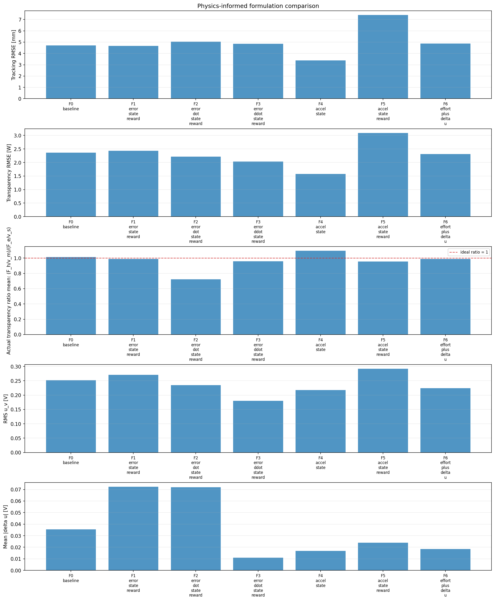
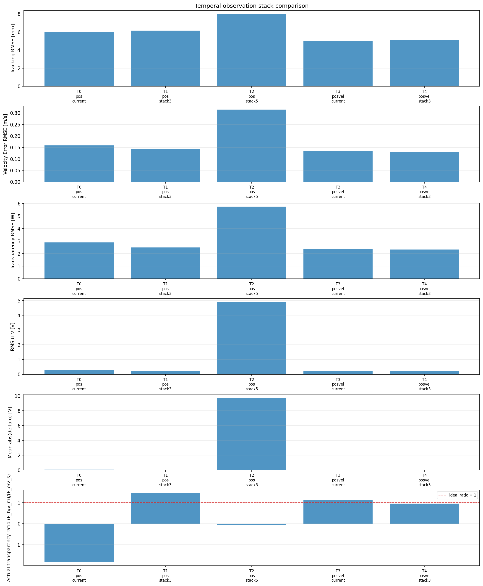

# Results catalog

`90_results_catalog.ipynb` is the review entry point for normalized run
metadata and selected summaries. The tracked result report is
[`../../results_index/all_results.md`](../../results_index/all_results.md).

## What is included

- `results_index/runs.csv`: one normalized row per current variant
- `results_index/all_results.md`: complete tables and interpretation
- `results_index/figures/`: tracked comparison, learning, and diagnostic graphs
- local raw result folders: model checkpoints, histories, TensorBoard logs, and
  scenario-level plots when available

The current catalog covers 25 final fair-bias-15 PPO variants: reward,
physics-informed, temporal-observation, and auxiliary-GRU studies. It reports
focused tracking, post-contact behavior, transparency, ratio validity,
control smoothness, and failure rate.

The earlier MATLAB/DQN/Q-learning entries referenced result roots that are not
present in this checkout, so they are not included as current reproducible
rows. Some executed notebooks retain embedded historical outputs; these are
archival evidence only and are not part of the normalized current catalog.
