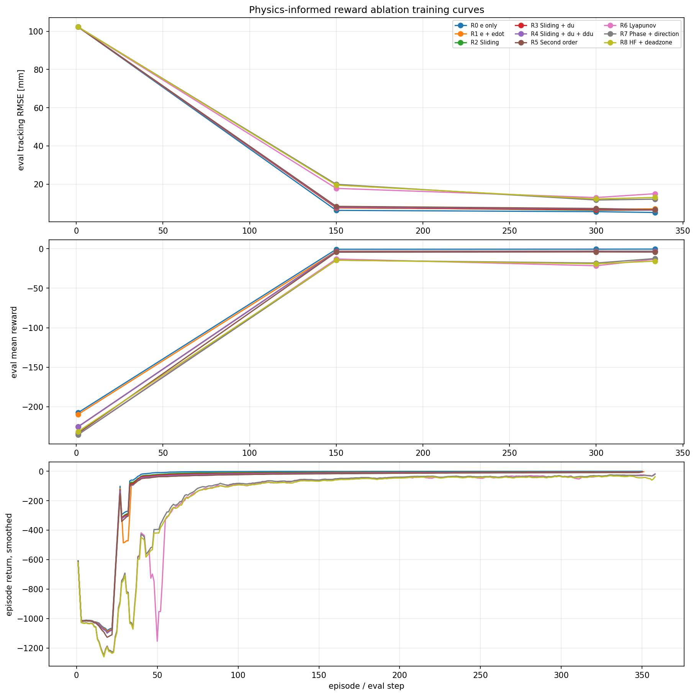
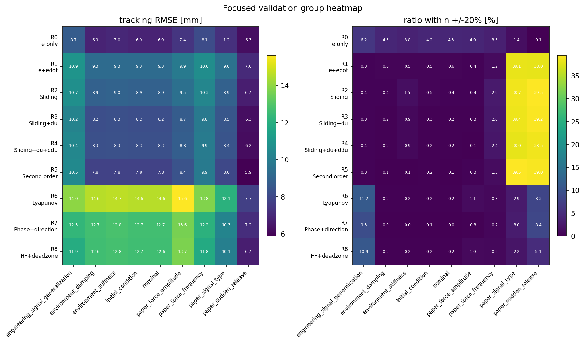
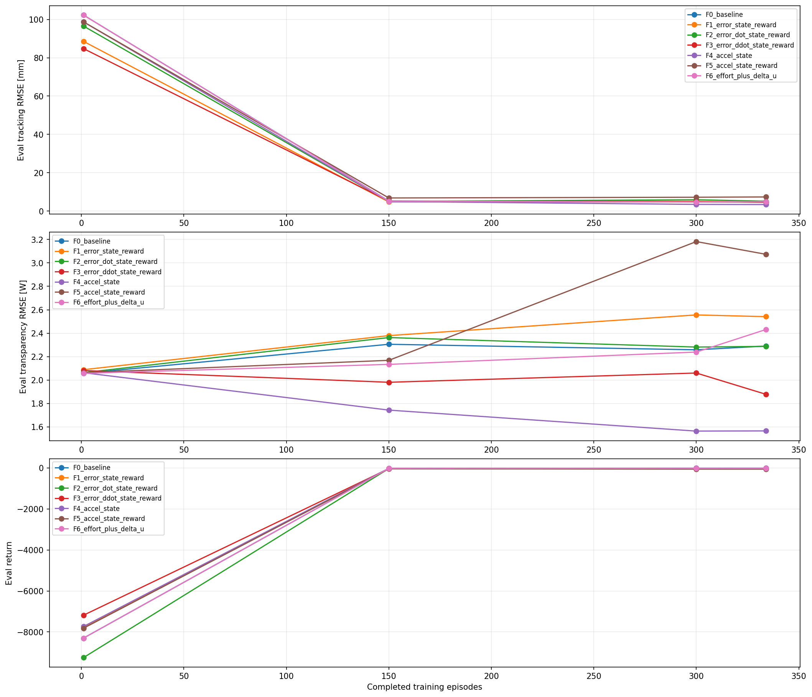
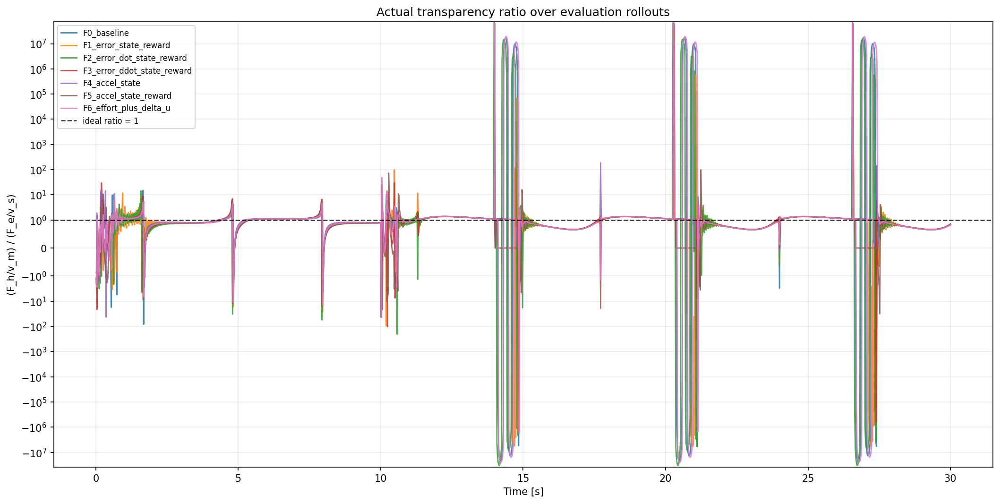
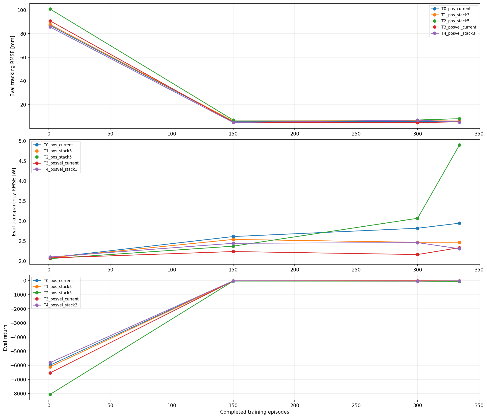

# Results index

This README is the self-contained, reviewable result record for the current
comparable experiments. It contains the exact tables and tracked graphs. Raw
training trees remain local because they contain large model, history, plot,
TensorBoard, and machine-specific path artifacts.

## Protocol

- PPO on the Python SimuOriginal replica
- fair force-bias-15 evaluation protocol
- 500,000 training steps and 32 test episodes
- one training signal and one evaluation signal
- 25 focused evaluation scenarios per variant

The values below are focused-evaluation aggregates. `Ratio` is the reported
transparency-ratio statistic, computed as the mean of the scenario-level
medians. A good ratio is close to `1.0`; ratio validity and the fraction within
±20% must be read alongside it.

## Summary conclusions

- `F4_accel_state` has the lowest focused tracking RMSE: **3.535 mm**.
- `R5_second_order` has the ratio statistic closest to one: **1.009**, but its
  tracking RMSE is higher at **8.386 mm**.
- `T3_posvel_current` is the strongest temporal observation compromise:
  **5.177 mm** tracking RMSE and a **1.075** ratio statistic.
- The auxiliary GRU variants do not currently provide a usable candidate:
  focused tracking RMSE is **76.529–123.245 mm**, with high failure or invalid
  ratio behavior.

## Reward ablation: R0-R8

| ID | Formulation | Track RMSE [mm] | Post-contact [mm] | Transp. RMSE [W] | Ratio | Ratio error RMSE | Valid | Within +/-20% | RMS u [V] | Mean \|du\| [V] | Mean \|d2u\| [V] | Failure |
|---|---|---:|---:|---:|---:|---:|---:|---:|---:|---:|---:|---:|
| R0 | e only | 7.333 | 6.527 | 1.677 | 0.044 | 241.511 | 66.1% | 3.6% | 3.576 | 6.490 | 12.966 | 0.0% |
| R1 | e + edot | 9.659 | 8.867 | 1.235 | 1.227 | 366.462 | 56.9% | 8.1% | 0.268 | 0.076 | 0.131 | 0.0% |
| R2 | Sliding | 9.276 | 8.334 | 1.198 | 1.226 | 669.090 | 56.8% | 8.6% | 0.274 | 0.109 | 0.200 | 0.0% |
| R3 | Sliding + du | 8.664 | 7.670 | 1.236 | 1.251 | 256.399 | 56.7% | 8.4% | 0.255 | 0.030 | 0.027 | 0.0% |
| R4 | Sliding + du + ddu | 8.718 | 7.691 | 1.232 | 1.261 | 356.875 | 56.7% | 8.2% | 0.248 | 0.027 | 0.020 | 0.0% |
| R5 | Second order | 8.386 | 7.162 | 1.272 | **1.009** | 688.738 | 55.5% | 8.2% | 0.239 | 0.025 | 0.015 | 0.0% |
| R6 | Lyapunov | 13.865 | 13.203 | 1.174 | 0.579 | 28.710 | 52.7% | 2.1% | 0.137 | 0.024 | 0.032 | 0.0% |
| R7 | Phase + direction | 12.093 | 11.262 | 1.156 | 0.593 | 184.424 | 53.1% | 1.7% | 0.148 | 0.029 | 0.040 | 0.0% |
| R8 | HF + deadzone | 11.952 | 11.454 | 1.189 | 1.099 | 71.228 | 53.4% | 1.8% | 0.158 | 0.031 | 0.043 | 0.0% |

## Physics-informed formulations: F0-F6

The study-generated bars and learning curves below use the overall test
aggregate fields. The table uses the focused battery so it remains comparable
with the other study families.

| ID | Formulation | Track RMSE [mm] | Post-contact [mm] | Transp. RMSE [W] | Ratio | Ratio error RMSE | Valid | Within +/-20% | RMS u [V] | Mean \|du\| [V] | Mean \|d2u\| [V] | Failure |
|---|---|---:|---:|---:|---:|---:|---:|---:|---:|---:|---:|---:|
| F0 | Baseline | 4.543 | 2.880 | 1.389 | 0.621 | 88.307 | 64.4% | 8.0% | 0.762 | 0.780 | 1.517 | 0.0% |
| F1 | Add Error | 4.667 | 3.198 | 1.435 | 0.455 | 1136.514 | 64.3% | 6.9% | 0.974 | 1.013 | 1.952 | 0.0% |
| F2 | Add Error Dot | 4.907 | 3.359 | 1.326 | 0.322 | 240.544 | 67.9% | 5.5% | 1.318 | 1.487 | 2.873 | 0.0% |
| F3 | Add Error DDot | 4.693 | 2.820 | 1.277 | 1.190 | 950.544 | 56.2% | 10.6% | 0.264 | 0.077 | 0.130 | 0.0% |
| F4 | Accel State | **3.535** | 2.411 | 1.348 | 0.776 | 144.719 | 64.8% | 9.6% | 0.922 | 1.099 | 2.090 | 0.0% |
| F5 | Accel State + Reward | 15.893 | 14.588 | 1.618 | 0.595 | 1946.017 | 57.0% | 13.0% | 0.466 | 0.075 | 0.084 | 0.0% |
| F6 | Effort + Delta U | 5.002 | 3.288 | 1.330 | **0.917** | 683.580 | 62.7% | 8.4% | 0.336 | 0.211 | 0.380 | 0.0% |

## Temporal observations: T0-T4

The study-generated bars and learning curves below use the overall test
aggregate fields. The table uses the focused battery so it remains comparable
with the other study families.

| ID | Formulation | Track RMSE [mm] | Post-contact [mm] | Transp. RMSE [W] | Ratio | Ratio error RMSE | Valid | Within +/-20% | RMS u [V] | Mean \|du\| [V] | Mean \|d2u\| [V] | Failure |
|---|---|---:|---:|---:|---:|---:|---:|---:|---:|---:|---:|---:|
| T0 | Position Current | 6.487 | 5.028 | 1.664 | **1.045** | 18.305 | 55.4% | 6.6% | 0.302 | 0.103 | 0.183 | 0.0% |
| T1 | Position Stack 3 | 6.488 | 4.806 | 1.412 | **1.045** | 20.668 | 55.7% | 10.9% | 0.243 | 0.033 | 0.034 | 0.0% |
| T2 | Position Stack 5 | 8.071 | 6.521 | 1.873 | 0.003 | 77.438 | 77.2% | 3.7% | 4.831 | 9.606 | 19.217 | 0.0% |
| T3 | Position Velocity Current | 5.177 | 3.348 | 1.357 | 1.075 | 417.006 | 57.0% | 10.4% | 0.404 | 0.341 | 0.666 | 0.0% |
| T4 | Position Velocity Stack 3 | 4.967 | 2.898 | 1.393 | 0.505 | 319.730 | 64.2% | 6.1% | 1.194 | 1.324 | 2.576 | 0.0% |

## Auxiliary GRU-PPO: G0-G3

| ID | Formulation | Track RMSE [mm] | Post-contact [mm] | Transp. RMSE [W] | Ratio | Ratio error RMSE | Valid | Within +/-20% | RMS u [V] | Mean \|du\| [V] | Mean \|d2u\| [V] | Failure |
|---|---|---:|---:|---:|---:|---:|---:|---:|---:|---:|---:|---:|
| G0 | GRU-PPO | 76.529 | 180.343 | 1.007 | 0.012 | 4.824 | 9.5% | 0.8% | 0.122 | 0.000 | 0.000 | 100.0% |
| G1 | GRU + prediction | 85.159 | 102.897 | 0.699 | 0.366 | 29.979 | 28.0% | 9.1% | 0.033 | 0.000 | 0.000 | 8.0% |
| G2 | GRU + hidden state | 123.245 | 158.799 | 0.647 | 0.290 | 1139.181 | 12.4% | 7.5% | 0.051 | 0.000 | 0.000 | 96.0% |
| G3 | GRU + both auxiliary heads | 118.588 | n/a* | 4.551 | 0.000 | 1.392 | 17.9% | 6.2% | 1.098 | 0.001 | 0.001 | 100.0% |

\* No valid post-contact segment was available for G3; the source summary
stores this as zero, but it is represented here as `n/a` rather than as a
measured zero.

## Interpretation and limitations

The results support selecting a candidate only after choosing the primary
objective. `F4` is the current tracking leader, `R5` is closest to the ideal
ratio statistic, and `T3` is the most balanced temporal candidate. The ratio
error values can be much larger than the ratio statistic because the force /
velocity ratio is ill-conditioned near zero velocity; validity and within-20%
coverage are therefore part of the result, not optional annotations.

The current comparison uses one study per formulation under one force signal.
Before treating a candidate as final, repeat the selected configurations over
multiple seeds and signals, then report mean ± standard deviation.

The machine-readable catalog is [`runs.csv`](runs.csv).

## Raw artifact contract

When present locally, raw outputs are written under
`../matlab_env_python_replica/policy_gradient_experiments/results/`. They
normally contain `summary.csv`, `study_manifest.json`, per-run `summary.json`,
model checkpoints, histories, plots, and optional `focused_eval/` bundles.
The current README and figures remain reviewable even when those large raw
trees are not committed.

The previous catalog contained MATLAB, DQN, and Q-learning paths that do not
exist in this checkout. They were removed from the current `runs.csv` instead
of being presented as reproducible current results. Some executed notebooks
retain embedded historical tables or images; treat those as archival evidence,
not as a portable result artifact or a current normalized row.
