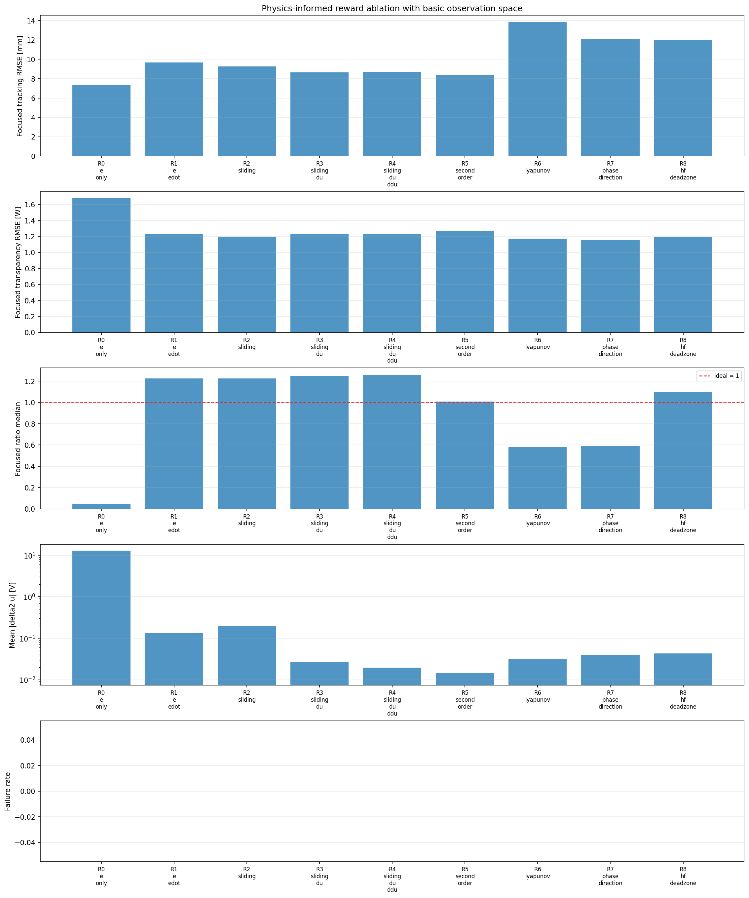
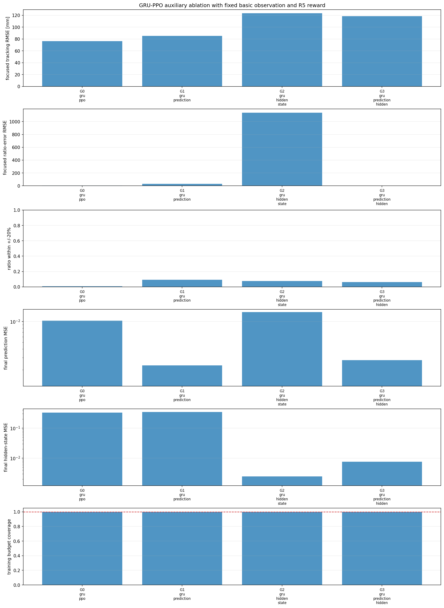

# Results Index

This folder is the tracked, reviewable summary of the experiment results. Raw
training trees remain local because they contain large model, history, plot,
TensorBoard, and machine-specific path artifacts.

## Current catalog

[`runs.csv`](runs.csv) contains the normalized rows for the latest comparable
PPO protocol. [`all_results.md`](all_results.md) is the human-readable report
with every current variant and the tracked graphs.

The current catalog contains 25 variants in four fair-bias-15 studies:

- 9 reward formulations (`R0`–`R8`)
- 7 physics-informed formulations (`F0`–`F6`)
- 5 temporal observation formulations (`T0`–`T4`)
- 4 auxiliary GRU formulations (`G0`–`G3`)

The common protocol is 500,000 training steps and 32 test episodes. Each study
uses one training signal and one evaluation signal, and the focused battery
contains 25 scenarios. These are single-study results, not multi-seed claims.

## Metric policy

- Tracking RMSE and post-contact RMSE are reported in millimetres; lower is
  better.
- Transparency RMSE is the focused power/transparency error in watts; lower is
  better.
- The transparency-ratio statistic should be near `1.0`.
- Ratio validity and the fraction within ±20% are reported because ratios are
  unstable when the velocity denominator is near zero.
- Failure rate is reported separately from episode completion.

## Figures

The small figures used in the READMEs are tracked in [`figures/`](figures/).
They are copied from the latest local study outputs and are not a substitute
for the raw histories.






## Raw artifacts

When present locally, raw outputs are written under:

```text
matlab_env_python_replica/policy_gradient_experiments/results/
```

They normally contain `summary.csv`, `study_manifest.json`, per-run
`summary.json`, model checkpoints, histories, plots, and optional
`focused_eval/` bundles. The expected artifact contract is documented in
[`../matlab_env_python_replica/CLI.md`](../matlab_env_python_replica/CLI.md).

The previous catalog contained MATLAB, DQN, and Q-learning paths that do not
exist in this checkout. They were removed from the current `runs.csv` instead
of being reported as reproducible current results. Some executed notebooks
retain embedded historical tables or images; treat those as archival evidence,
not as a portable result artifact or a current normalized row.
